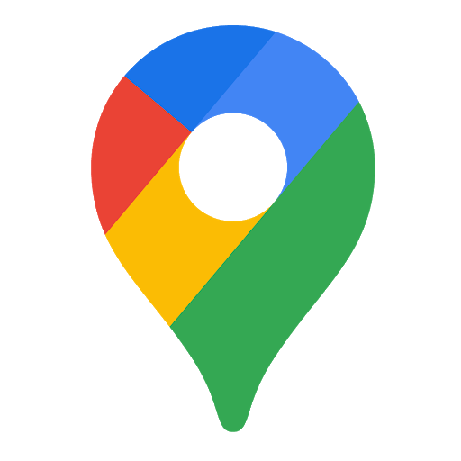

# Welcome To Fridgeventory!

## Making decreased food waste a priority.

 
 

## Description

Fridgeventory was created with a vision, to decrease food waste one person at a time.

Keep track of your expired products, and share products with your hood before they expire.
 
 

## Main Technologies:

&nbsp;&nbsp;&nbsp;&nbsp;&nbsp;&nbsp;&nbsp;&nbsp;&nbsp;&nbsp;&nbsp;&nbsp;&nbsp;&nbsp;&nbsp;&nbsp;&nbsp;&nbsp;&nbsp;&nbsp;&nbsp;&nbsp;&nbsp;&nbsp;&nbsp;&nbsp;&nbsp;
 
 

## Packages:

-   Lottie
-   React-Hamburger-Menu
-   React-Photo-Collage
     
     

## Future Features:

-   Managing your shopping list
-   Join several hoods
-   Personal profile
-   In app chat
-   Statistics
-   Recipe planning
-   Website translation (i18n)

     
     

## Website Link

[Fridgeventory](http://fridgeventory.uksouth.cloudapp.azure.com)
